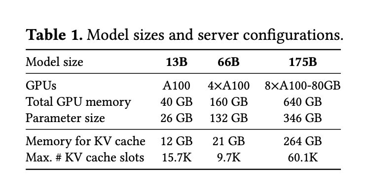
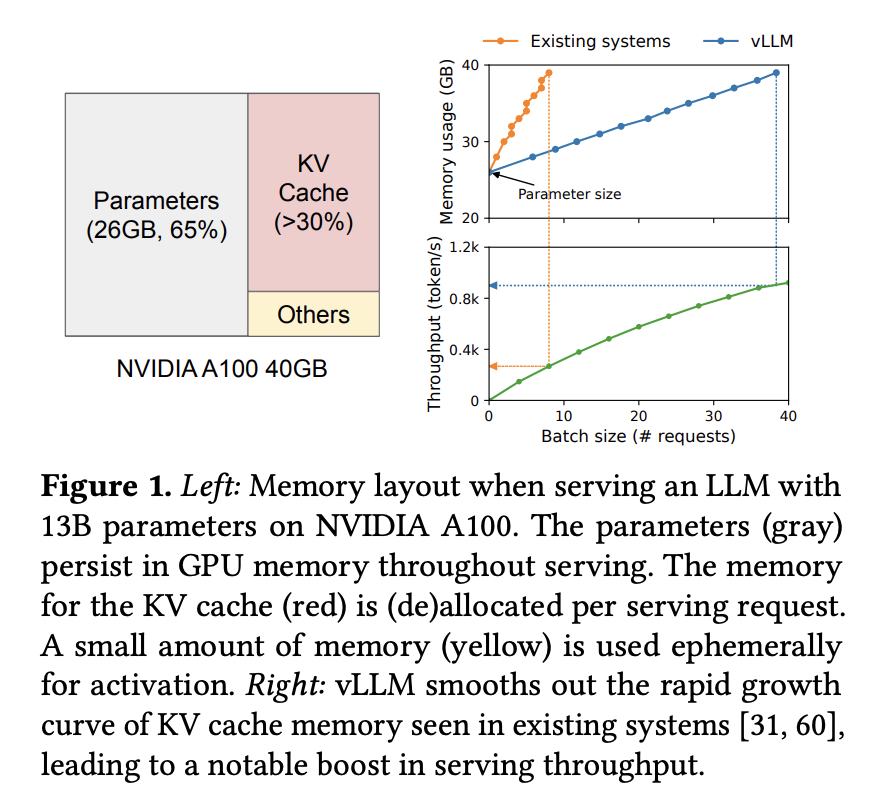
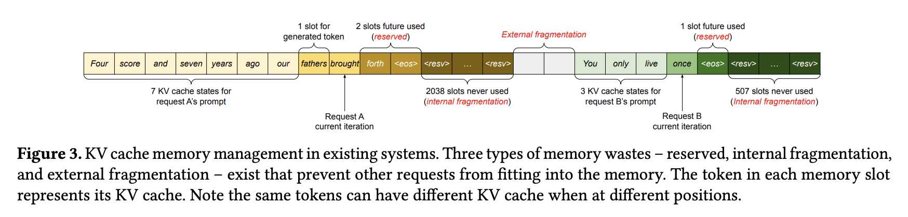
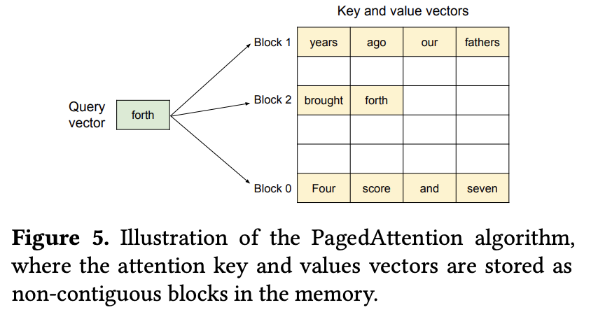
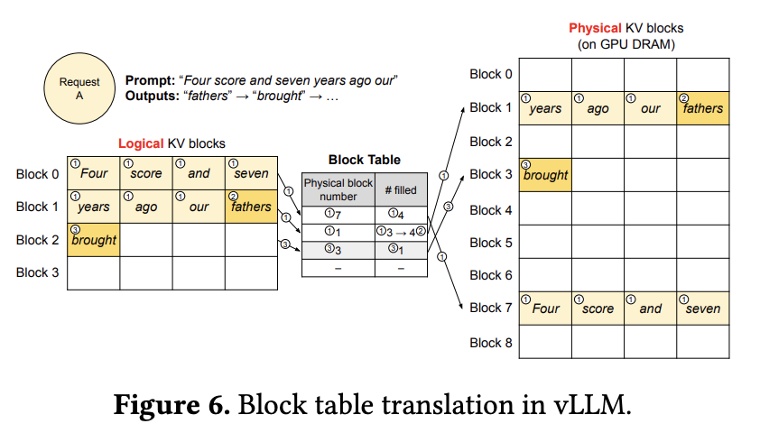
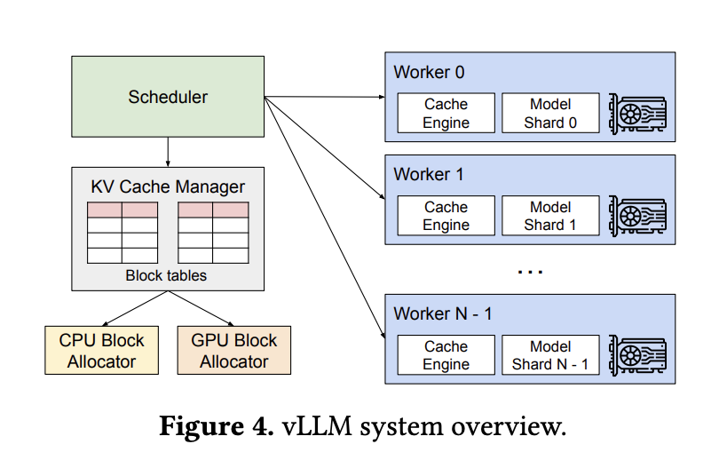
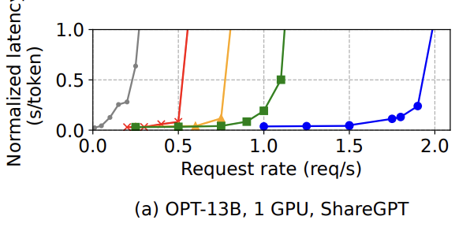

# vLLM: Efficient Memory Management for LLM Serving with PagedAttention  
**Paper**: https://arxiv.org/pdf/2309.06180  
**Authors**: Woosuk Kwon, Zhuohan Li, Siyuan Zhuang, Ying Sheng, Lianmin Zheng, Cody Hao Yu, Joseph E. Gonzalez, Hao Zhang, Ion Stoica  
**Presenter**: Yan Zhang  

---

## 1. Overview

Large language model inference is dominated not by compute, but by GPU memory usage — especially the memory consumed by the **Key–Value (KV) cache** during autoregressive decoding. For each generated token, the model must use all previously computed keys and values. This causes the KV cache to grow linearly with sequence length, and for models such as OPT-13B and LLaMA-13B, a single request can consume over **1 GB** of KV-cache memory.

To illustrate the magnitude of KV-cache memory, the table below shows the memory breakdown for 13B/66B/175B OPT models. Even a 13B model requires **12 GB** of KV-cache memory at maximum capacity.

<p align="center">  </p>

Traditional LLM serving systems allocate **one large contiguous KV buffer** per request. This design is simple but extremely inefficient. As requests with different lengths start and finish, GPU memory forms small free gaps that cannot hold another contiguous KV buffer. Even with plenty of total remaining memory, the system rejects new requests due to external **fragmentation**. Empirical results show that only **20–38%** of allocated KV memory contains real token data.

<p align="center">  </p>

To address this mismatch, vLLM introduces **PagedAttention**, inspired by OS virtual memory. Instead of requiring contiguous memory, vLLM splits KV-cache into **fixed-size blocks**. A per-request **block table** maps logical positions to physical locations. Blocks can be placed anywhere in GPU memory, eliminating fragmentation, improving block reuse, enabling continuous batching, and significantly increasing throughput.

### Question 1
Why does allocating one large contiguous KV cache per request inevitably cause memory fragmentation as batch composition changes over time?
<details>
  <summary><strong>Answer</strong><br>
  </summary>

Because freed memory returns as many small scattered gaps, but each request needs one large continuous KV buffer. New requests cannot fit into these small fragments, so memory becomes unusable even when total free memory is still large.

</details>

---

## 2. Problem: Why Existing KV Allocation Fails

Traditional LLM serving frameworks such as FasterTransformer or HuggingFace Transformers use a **contiguous KV cache per request**. Although easy to implement, this causes three fundamental types of memory waste.

### 2.1 Reservation Waste

Because the size of the KV cache must support the maximum possible sequence length, the system reserves far more memory than most real requests need. A user input of 200 tokens still reserves space for the maximum length (e.g., 2048 or 4096), leaving a large unused portion.

### 2.2 Internal Fragmentation

If a request finishes earlier than expected, the unused portion of its preallocated KV buffer remains unusable by other requests. Even if 70% of the buffer is empty, no other request can use that space, because buffers must stay contiguous.

### 2.3 External Fragmentation

This is the most damaging form. As requests with different lengths start and finish over time, the GPU memory becomes filled with small free gaps. These gaps cumulatively hold a large amount of free memory, but because each gap is too small to fit a full contiguous KV buffer, they cannot be used.

<p align="center">  </p>

### Inefficiency in Practice

The paper evaluates popular serving systems (Orca Max, Orca Pow2, Orca Oracle) and finds that only 20–38% of their KV memory stores actual token states. The remainder is lost to reservation, internal fragmentation, and external fragmentation.

This inefficiency is the core motivation for PagedAttention: **the constraint of contiguity must be removed**.

---

## 3. PagedAttention: Key Idea and Intuition

PagedAttention solves the core problem by rejecting the assumption that KV cache must be contiguous. Instead, vLLM divides memory into fixed-size blocks (like OS pages) and allows these blocks to be placed anywhere in GPU memory.

Each request maintains a **block table**, a simple mapping:
```
logical token index → physical block ID
```
This provides the model with a virtual contiguous KV address space, while the GPU can freely reuse and rearrange blocks.

<p align="center">  </p>

### Logical-to-Physical Translation

As new tokens are generated, their KV vectors are written into blocks assigned by the block allocator. When computing attention, the model retrieves all KV blocks corresponding to the history of the sequence. The block table decouples logical ordering from physical layout.

<p align="center">  </p>

### Why This Works

PagedAttention achieves:

* near-zero memory waste
* instant block reuse
* efficient support for prefix sharing
* dynamic continuous batching
* beam search and parallel sampling without copying KV
* stable high throughput

Without modifying model weights or architecture.

### Question 2
Under PagedAttention, why is it no longer necessary for KV cache to be stored contiguously in memory?
<details>
  <summary><strong>Answer</strong><br>
  </summary>

Because each request uses a block table that preserves logical KV order. The model sees a virtual contiguous layout even though physical KV blocks are scattered in memory.
</details>

---

## 4. Architecture Overview

PagedAttention integrates into a broader system architecture that includes scheduling, block management, and multi-worker execution.

* Scheduler  
The scheduler dynamically batches requests and determines which tokens to generate next. Because PagedAttention allows requests to join or leave at any step, the scheduler can perform continuous batching, significantly increasing throughput.

* KV Cache Manager  
Maintains block tables for all active requests and handles allocation and freeing of blocks.

* CPU/GPU Block Allocators  
Allocate physical blocks on GPU (or CPU when offloading is needed). Because blocks are fixed-size, they can be reused immediately.

* Workers  
Each worker hosts a shard of the model and executes PagedAttention to fetch KV blocks based on block tables.

<p align="center">  </p>

---

## 5. PagedAttention Workflow

Below is the conceptual workflow used during decoding:
```
1. Identify the range of logical token indices needed.
2. Translate each logical position to a physical block via the block table.
3. Load the KV slices from the corresponding blocks.
4  Concatenate the slices logically.
5. Compute attention using these KV vectors.
6. Write the new KV vectors into the next available position; allocate new blocks if needed.
```
This process makes PagedAttention both simple and extremely powerful.

---

## 6. Block Management & Advanced Features

PagedAttention’s block-based design enables several advanced features.

* Continuous Batching  
Requests may enter or exit the batch at any time. The system does not need to reallocate KV cache when the batch changes.

* Multi-Request KV Storage  
Multiple requests coexist in GPU memory, each with its own block table.

* Parallel Sampling (Copy-on-Write)  
Parallel sampling requires multiple generations from the same prefix. vLLM shares prefix blocks across samples and uses copy-on-write for divergent tokens.

* Beam Search  
Beam search paths share prefix blocks until they diverge, dramatically reducing memory compared to copying the entire KV buffer.

* Shared Prefix Tasks  
Many tasks (e.g., translation with few-shot examples) naturally share long prompts.

---

## 7. Results & Experiments

The authors evaluate OPT-13B/66B/175B models on ShareGPT and Alpaca traces. Across all experiments, vLLM delivers:

* **2×–4× higher throughput**
* **substantially larger batch sizes**
* **stable latency**
* **no fragmentation-induced OOM**
  
Below is one representative latency curve:

<p align="center">  </p>

This shows that systems like FasterTransformer and Orca quickly hit latency spikes as request rate increases, while vLLM remains stable until much higher throughput.

---

## 8. Critical Analysis
### Strengths

* Elegant OS-inspired solution
* Eliminates all fragmentation
* Highly practical in production
* No model weight modification
* Strong support for advanced decoding algorithms

### Weaknesses

* Block-table overhead is not deeply profiled
* Limited discussion on multi-GPU synchronization
* Optimal block size still involves trade-offs
  
### Potential Improvements

* Adaptive block sizing
* More advanced scheduling fairness
* Better pipelining of block fetch with compute

---

## 9. Impact
### Practical Impact
vLLM significantly reduces memory waste during inference, allowing larger batch sizes and higher throughput without requiring any changes to model weights. This directly lowers serving cost and makes deployment of large models far more efficient on commodity GPUs.

### Scientific Impact
The work reframes LLM serving as a memory-management problem rather than a compute-bound problem. By introducing a paging-style abstraction to attention, it highlights the importance of system-level design in achieving major performance gains.

### Ecosystem Influence
- HuggingFace TGI  
- TensorRT-LLM  
- LightLLM  
- LMDeploy and other industrial serving stacks  
PagedAttention is now viewed as a standard approach for KV-cache management across modern LLM inference frameworks.

---

## 10. Resource Links
[Original Paper](https://arxiv.org/pdf/2309.06180)  
[vLLM Official Repository](https://github.com/vllm-project/vllm)  
[vLLM Documentation](https://docs.vllm.ai)    
[Paper Reproduction](https://github.com/SZU-AdvTech-2024/003-Efficient-Memory-Management-for-Large-Language-Model-Serving-with-PagedAttention)  
[HuggingFace TGI (influenced by vLLM concepts)](https://github.com/huggingface/text-generation-inference)

---

## 11. Citation

Kwon, W., Yao, Z., Wang, S., Zheng, L., Zhang, Y., Liu, T., Yu, R., Zaharia, M., & Stoica, I. (2023).  
**Efficient Memory Management for Large Language Model Serving with PagedAttention.**  
*arXiv preprint arXiv:2309.06180.*
```
@inproceedings{kwon2023efficient,
  title={Efficient Memory Management for Large Language Model Serving with PagedAttention},
  author={Woosuk Kwon and Zhuohan Li and Siyuan Zhuang and Ying Sheng and Lianmin Zheng and Cody Hao Yu and Joseph E. Gonzalez and Hao Zhang and Ion Stoica},
  booktitle={Proceedings of the ACM SIGOPS 29th Symposium on Operating Systems Principles},
  year={2023}
}
```
